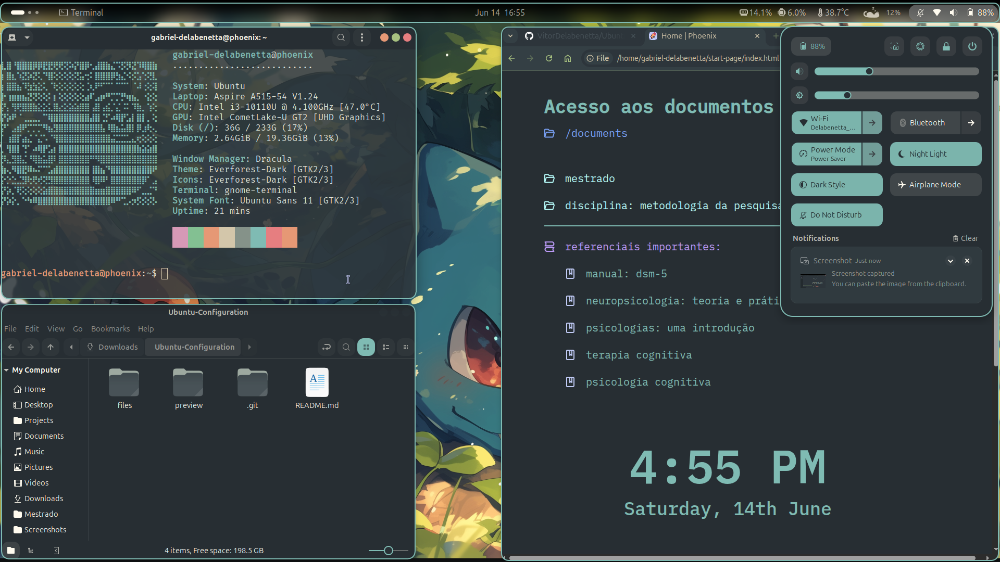
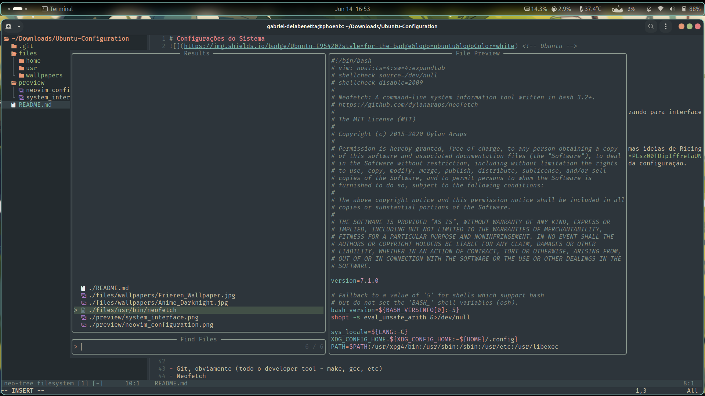

## Configurações do Gnome

Estas configurações foram realizadas ao longo do tempo através do Gnome Tweaks e do Extension Manager, bem como seguindo algumas ideias de Ricing através do Reddit. As imagens de preview são do Ubuntu, não do Arch, mas após configurações eles ficam o mesmo.

 

## 🛠 Preview

<i>Imagem de preview das configurações e da interface do sistema</i>

<i>Imagem da interface do Neovim após configurações - comentar os temas do Catppuccin e descomentar os do Everforest</i>
 

 

## 🛠 Dados Técnicos

> Aplicativos utilizados foram:
> - Rofi
> - Nemo (explorador de arquivos)
> - Terminal do Ubuntu (pode ser configurado no Kitty)
> - Chromium (com Vimium e AdBlock Plus)

Para o terminal, foram instalados também as seguintes extensões:

- Git (com todo o developer tool - make, gcc, etc)
- Neofetch
- Tree, para poder ver os arquivos em árvore
- No Arch, tenho também o <a href="https://mierak.github.io/rmpc/next/overview/" target="_blank">RMPC</a>

As extensions instaladas no Gnome Tweaks, foram:

- App menu
- Blur my Shell
- Quick settings tweaks
- Rounded window corners reborn (não é necessário no Hyprland)
- RunCat & Vitals (para o último, estavam configurados para mostrar: temperatura "average"; memória "usage"; processador "usage")
